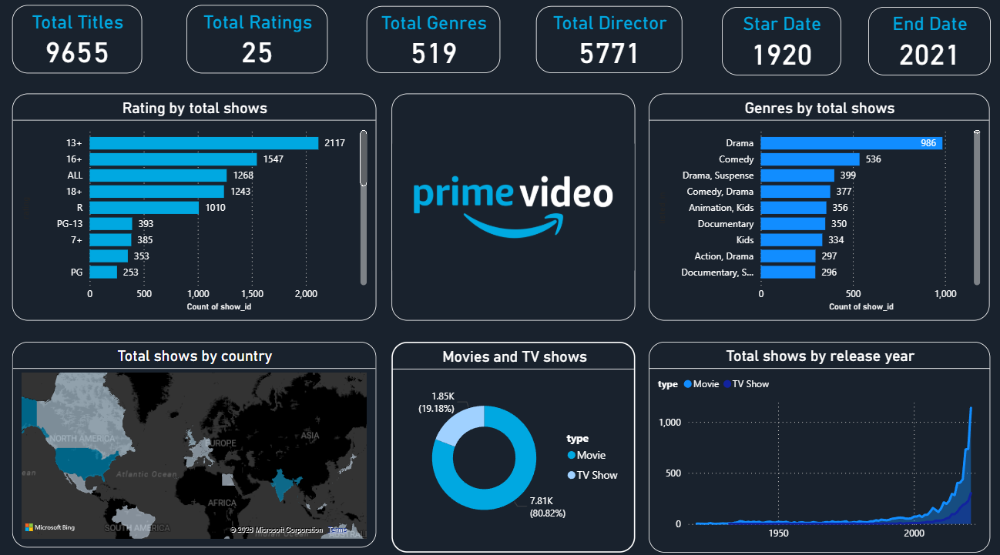

# Amazon Prime Video Power BI Dashboard

## 📌 Project Overview
This project presents an interactive Power BI dashboard analyzing Amazon Prime Video content.  
The dashboard provides insights into movies and TV shows based on genres, ratings, countries, and release trends.

---

## 📊 Key Insights
- Total Titles: 9,655
- Total Genres: 519
- Total Directors: 5,771
- Content spans from 1920 to 2021
- Movies dominate the platform compared to TV Shows

---

## 🗂 Dataset Information
The dataset includes:
- Title Name
- Genre
- Director
- Country
- Release Year
- Content Type (Movie/TV Show)
- Ratings

---

## 🚀 Project Highlights
- Interactive filters and slicers
- Genre and release year analysis
- Clean and professional dashboard layout

---

## 📸 Dashboard Preview

---

⚠️ Note: The Power BI (.pbix) file is not uploaded due to GitHub file size limitations.

